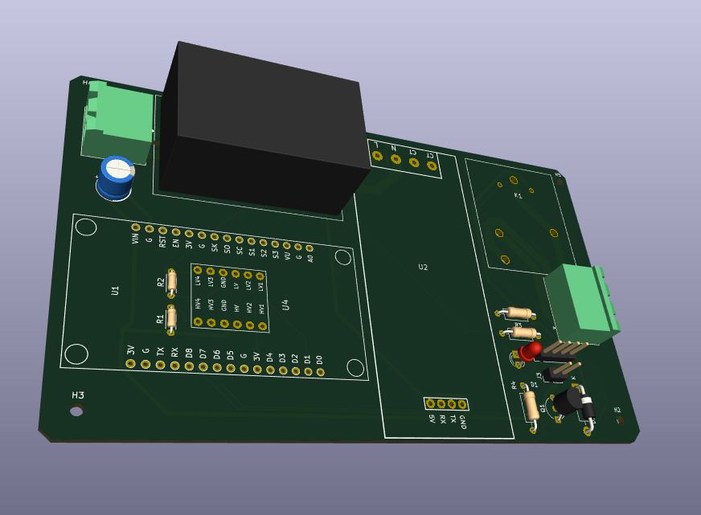
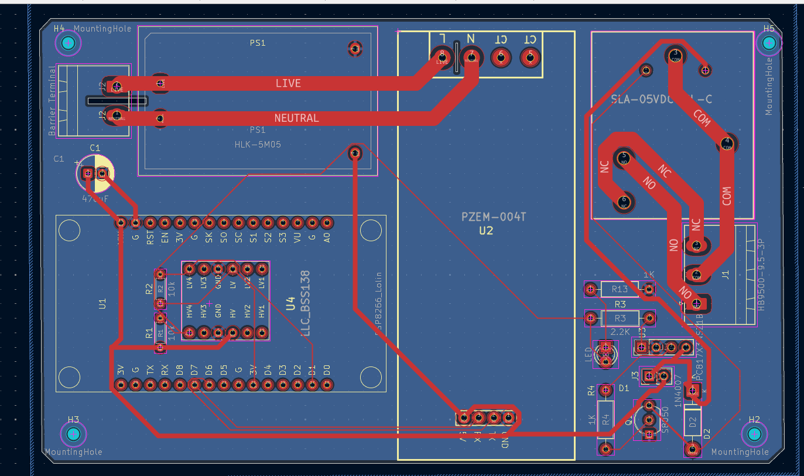
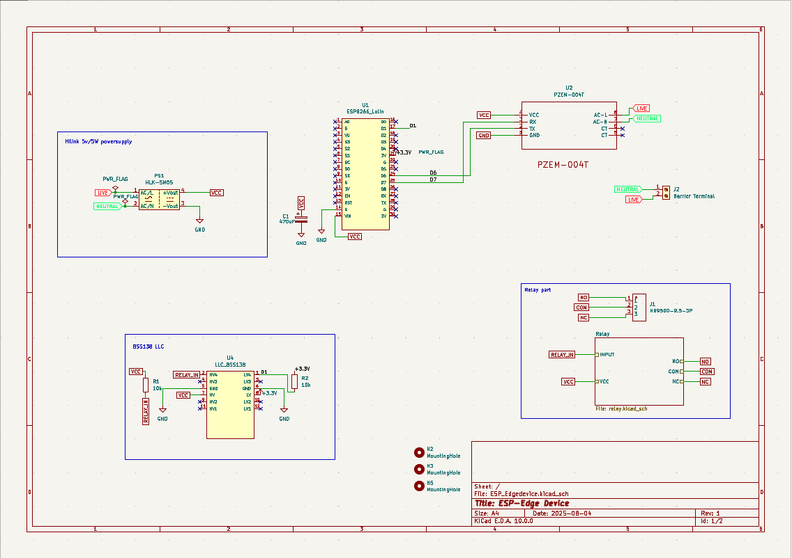

# Industrial IoT Smart Edge Device & Isolated Energy Controller

**A robust, mixed-signal hardware platform designed for AC mains energy monitoring, power conversion, and isolated load control. Engineered with high-voltage clearance, discrete signal shifting, and inductive load protection.**

---

## 📖 Overview

This **Smart Edge Node** is an industrial/home energy monitoring and switching board that bridges high-voltage AC mains power with low-voltage microcontroller logic. Designed with a focus on **analog hardware reliability**, **power distribution**, and **galvanic isolation**, the design integrates on-board AC-DC regulated conversion, discrete MOSFET level translation, and an optoisolated transistor relay driver with flyback suppression.

The system utilizes an **ESP8266 (Lolin)** for edge processing and software-driven UART communication with a **PZEM-004T** metering module, enabling real-time telemetry publication over Wi-Fi (MQTT/HTTP) while safely controlling heavy AC electrical loads.

---

## 📸 Visuals

| **3D PCB Render** | **PCB Layout & Routing** | **Hardware Schematic** |
|:---:|:---:|:---:|
|  |  |  |
| *KiCad 3D Ray-traced Board View* | *2-Layer Trace & High-Voltage Clearance* | *System Schematic Architecture* |

---

## ⚡ Hardware & Analog Engineering Highlights

### 1. Power Management & Bulk Decoupling
* **Integrated AC-DC Conversion:** Employs an on-board **Hi-Link HLK-5M05** module to convert $230\text{V AC}$ mains input directly down to a regulated $5\text{V DC}$ supply rail.
* **Transient Suppression & Ripple Filtering:** Features a high-capacity **$470\ \mu\text{F}$ bulk electrolytic capacitor ($C1$)** across the $5\text{V}$ rail to absorb voltage dips, suppress power supply ripple, and maintain rail stability during high instantaneous relay coil pull-in current.

### 2. Level Translation & Signal Integrity
* **Bi-Directional MOSFET Level Shifting:** Incorporates a discrete **BSS138 N-channel MOSFET Logic Level Converter ($U4$)** to bridge the $3.3\text{V CMOS}$ GPIO output of the ESP8266 ($D1$) to the $5\text{V TTL}$ driver logic without overdriving MCU input pins.
* **Isolated UART Interface:** Software Serial UART interface ($D6/D7$) connecting to the **PZEM-004T** energy metering frontend for accurate RMS Voltage, Current, Active Power, Frequency, and Power Factor acquisition.

### 3. Optoisolated Load Control & Inductive Suppression
* **Galvanic Isolation Drive Stage:** High-voltage AC switching is completely isolated from low-voltage digital control using a **PC817 Optocoupler** and an **S8050 NPN transistor** driver stage.
* **Back-EMF Inductive Protection:** A **1N4007 flyback suppression diode ($D1$)** is placed across the **SLA-05VDC** relay coil to clamp high-voltage inductive spikes generated during coil de-energization, protecting switching silicon from overshoot breakdown.
* **Visual Diagnostics:** Integrated LED indicator with current-limiting resistor ($1\text{ k}\Omega$) for visual relay status feedback.

### 4. High-Voltage PCB Layout & Safety Design
* **Creepage & Clearance:** Wide physical clearance and routing separation between the $230\text{V}$ AC mains region (Live/Neutral) and low-voltage $5\text{V}/3.3\text{V}$ DC signal planes to prevent electrical arcing.
* **Current-Handling Traces:** Heavy trace widths utilized on AC Live/Neutral routing and high-current relay switching paths to minimize trace impedance, drop, and thermal rise under heavy electrical load.

---

## 🛠 Subsystem Breakdown

| Subsystem | Circuitry / Components | Function |
| :--- | :--- | :--- |
| **Power Supply** | HLK-5M05 + $470\ \mu\text{F}$ Capacitor | AC-DC Step-down ($230\text{V AC} \to 5\text{V DC}$) & Rail Filtering |
| **Microcontroller** | ESP8266 (Lolin V3 Footprint) | Wireless Telemetry, MQTT, SoftSerial UART, GPIO Control |
| **Logic Level Conversion** | BSS138 MOSFET Level Shifter ($U4$) | $3.3\text{V} \leftrightarrow 5\text{V}$ Logic Level Translation |
| **Relay Driver** | PC817 Optocoupler + S8050 NPN + 1N4007 Diode | Isolated coil energization & Back-EMF suppression |
| **AC Load Control** | SLA-05VDC High-Power Relay | Heavy AC Load ON/OFF Disconnect |
| **Energy Measurement** | PZEM-004T AC Sensor | High-accuracy RMS Voltage, Current, & Power Telemetry |

---

## 👨‍💻 Authors

- **Suvam Seth**
  *Power Engineering Student | PCB Design | Analog Electronics & Systems Design*

- **Sarin Sanyal**
  *Power Engineering Student | Analog & Mixed-Signal Circuit Design | Embedded Hardware | AI*